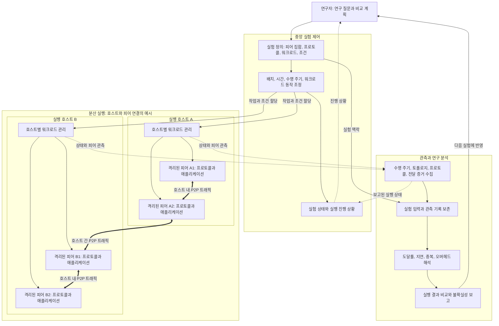

  

  <h1>K-P2PLab Hub</h1>

  

    <strong>K-P2PLab: 피어별 컨테이너 격리를 제공하는 중앙 오케스트레이션 기반 다중 호스트 P2P 테스트베드</strong>
  

  

    <a href="./README.md">English</a> ·
    <b>한국어</b>
  

  

    <b>개요</b> ·
    <a href="./docs/RESEARCH.kr.md">연구</a> ·
    <a href="https://github.com/k-p2p-lab/v3">공개 구현체</a>
  

---

## 개요

**K-P2PLab**은 통제된 실험 조건에서 피어 투 피어(P2P) 네트워크를 구성하고 실행하며 분석하는 연구용 테스트베드입니다. 실제 P2P 소프트웨어를 피어별 컨테이너에서 실행하고, 중앙에서 실험을 조정하면서 여러 호스트에 워크로드를 분산합니다.

이 저장소는 K-P2PLab의 **프로젝트 수준 Hub**입니다. 프로젝트의 목표, 설계 원칙, 개념 아키텍처, 발전 과정과 연구 논문을 한곳에 정리합니다.

> **실험 제어는 중앙에서, 피어 실행은 분산해서 수행합니다.**
>
> 플랫폼은 실험을 중앙에서 조정하며, 실험 대상 P2P 메시지는 피어 사이에서 교환됩니다.

---

## 문서 범위

| 저장소 | 정본으로 관리하는 내용 |
| --- | --- |
| **K-P2PLab Hub** | 프로젝트 목표, 버전 독립적인 설계 원칙, 개념 아키텍처, 프로젝트 발전 과정, 연구 주제, 논문과 인용 안내. |
| **구현 저장소** | 실행 동작, API와 시나리오 스키마, 명령과 환경 변수, 배포, 정확한 지표 공식과 이벤트, 운영 제약, 버전별 검증 기록. |

두 범위에 걸친 주제는 이 Hub에서 변하지 않는 개념을 설명하고, 정확한 동작 계약은 구현 저장소로 연결합니다. 현재 공개 구현체는 [K-P2PLab v3][v3-repo]입니다.

| 알고 싶은 내용 | 먼저 읽을 문서 | v3 구현 설명 |
| --- | --- | --- |
| 테스트베드의 목적과 역할 간 관계 | 아래 개요, 설계 원칙, 개념 아키텍처 | [구성 요소, 통신 경로, 격리][v3-architecture] |
| 실험을 정의하고 실행하는 방법 | 아래 실험 주기 | [시나리오 설정][v3-scenarios]과 [REST API][v3-api] |
| 여러 호스트에 워크로드를 분산하는 방법 | 아래 다중 호스트 실행 원칙 | [Linux 배포][v3-linux]와 [Swarm 배포][v3-swarm] |
| 관측으로 확인할 수 있는 범위 | [연구와 결과 보고 원칙](docs/RESEARCH.kr.md) | [지표 정의][v3-metrics], [모니터링과 결과][v3-monitoring], [토폴로지 뷰][v3-topology] |
| 인용할 연구 | [논문과 인용 안내](docs/RESEARCH.kr.md) | [v3 소스와 변경 이력][v3-repo] |

---

## 설계 원칙

| 원칙 | 의미 |
| --- | :--- |
| **중앙 오케스트레이션** | 중앙 제어 영역에서 실험 실행, 피어 수명 주기와 결과 수집을 조정합니다. |
| **다중 호스트 실행** | 실험을 단일 서버에 한정하지 않고 여러 호스트에 피어 워크로드를 분산합니다. |
| **실제 P2P 실행** | 피어를 모의 객체로만 표현하지 않고 실제 프로토콜 구현을 실행하여 네트워크 트래픽을 교환합니다. |
| **피어별 컨테이너 격리** | 각 피어에 별도의 컨테이너와 네트워크 네임스페이스를 제공하여 개별 관리가 가능한 실험 단위로 만듭니다. |

컨테이너 격리는 피어의 실행 환경과 네트워크 환경을 분리하지만, 전용 물리 자원을 제공하거나 같은 호스트의 자원 경합을 제거하지는 않습니다.

---

## 개념 아키텍처

테스트베드는 실험 제어, 분산 피어 실행, 관측이라는 세 가지 책임이 상호작용하는 구조입니다. 아래 그림은 특정 서비스 배치를 전제하지 않고 각 책임을 자세히 나타냅니다.

**화살표 읽는 법.** 가는 실선은 지시 또는 연구 작업 흐름, 굵은 양방향 화살표는 실험 P2P 트래픽, 점선은 관측을 나타냅니다. 그림의 호스트와 피어 연결은 예시이며, 필수 호스트 수나 고정 토폴로지 또는 완전 연결 구조를 뜻하지 않습니다. P2P 네트워크는 피어와 프로토콜 관계로 형성되며, 별도의 중앙 전달 서비스가 아닙니다.

| 책임 | 개념적 경계 |
| --- | --- |
| **실험 정의와 제어** | 의도한 피어 집합, 프로토콜 설정, 워크로드, 시간과 조건을 표현하고 실행을 조정하며 보고된 진행 상황을 추적합니다. 의도한 설정과 관측된 동작은 다를 수 있습니다. |
| **호스트별 실행** | 할당된 작업을 개별 관리 가능한 피어 워크로드로 실행하고 로컬 실행 보고를 수집합니다. 구체적인 실행 수단과 배치 정책은 구현에 따라 달라집니다. |
| **피어 프로토콜 실행** | 다른 피어를 탐색하고 연결하며, 프로토콜 관계를 유지하고 실험 메시지를 교환합니다. 중앙에서 요청한 워크로드 동작은 피어 활동을 시작하게 하지만, 제어기를 P2P 중계기로 만들지는 않습니다. |
| **관측과 기록** | 실행과 프로토콜의 증거를 실험 맥락에 연결합니다. 보고가 지연되거나 누락될 수 있으므로 수집된 상태는 네트워크 전체에 대한 완전한 지식이 아닌 관측입니다. |
| **연구 분석** | 측정값을 해석하고 실행 결과를 비교하며 가정과 불확실성을 보고합니다. 테스트베드 외부에서 수행하는 연구자의 작업도 포함하며, 자동 분석 서비스의 제공을 의미하지는 않습니다. |

위 구분은 논리적입니다. 각 상자가 별도 프로세스, 컨테이너, 물리 네트워크 또는 장애 영역으로 분리된다는 뜻은 아닙니다. 네트워크 조건은 선택한 실험 범위의 트래픽에 작용하며, 공유 호스트 자원과 물리 연결망도 결과에 영향을 줍니다. 구체적인 서비스, 네트워크 연결, 지원 제어와 측정 한계는 [v3 아키텍처 가이드][v3-architecture]를 참고하십시오.

---

## 실험 주기

실험은 연구 질문을 증거와 연결합니다. 아래 주기는 연구 작업 흐름이며, 실행 가능한 시나리오 스키마나 모든 단계의 자동화를 뜻하지 않습니다.

계획한 입력과 관측된 결과를 따로 기록하십시오. 같은 설정이나 난수 시드를 사용하면 실험 설정을 재현하는 데 도움이 되지만, 실행 시간, 토폴로지 또는 메시지 전달까지 같아지는 것은 아닙니다. 비교 기준은 [연구 결과 보고 원칙](docs/RESEARCH.kr.md)에서, 지원 동작의 표현 방법은 [v3 시나리오 가이드][v3-scenarios]에서 확인하십시오.

---

## 프로젝트 발전 과정

K-P2PLab은 여러 연구 구현을 거치며 발전했습니다. 각 버전은 같은 연구 계보를 공유하지만 아키텍처, 실험 제어와 측정 기능은 서로 다릅니다.

| 버전 | 중심 내용 | 공개 여부 |
| :---: | :--- | :--- |
| **v3** | 시나리오 기반 제어, 호스트별 Agent와 확장된 관측 기능으로 재설계한 구현. | [공개 소스 저장소][v3-repo]. |
| **v2** | 다중 호스트 P2P 실험과 토폴로지 분석을 위한 후속 플랫폼 설계. | [플랫폼 논문][v2-paper]; 소스 코드는 공개하지 않음. |
| **v1** | P2P 네트워크 구성과 토폴로지 분석을 위한 최초 플랫폼. | [플랫폼 논문][v1-paper]; 소스 코드는 공개하지 않음. |

설치, 설정, 지원 기능과 구현별 제한사항은 해당 저장소와 논문을 참고하십시오.

---

  
    <b><a href="https://github.com/k-p2p-lab">K-P2PLab</a> · <a href="https://comnet.kmu.ac.kr">컴퓨터네트워크 연구실</a></b>, <i><a href="https://www.kmu.ac.kr">계명대학교</a>, 대한민국 대구</i>
  

[v3-repo]: https://github.com/k-p2p-lab/v3
[v3-architecture]: https://github.com/k-p2p-lab/v3/blob/master/docs/architecture.kr.md
[v3-scenarios]: https://github.com/k-p2p-lab/v3/blob/master/docs/scenario-reference.kr.md
[v3-api]: https://github.com/k-p2p-lab/v3/blob/master/docs/api.kr.md
[v3-linux]: https://github.com/k-p2p-lab/v3/blob/master/docs/linux-deployment.kr.md
[v3-swarm]: https://github.com/k-p2p-lab/v3/blob/master/docs/swarm.kr.md
[v3-metrics]: https://github.com/k-p2p-lab/v3/blob/master/docs/experiment-metrics.kr.md
[v3-monitoring]: https://github.com/k-p2p-lab/v3/blob/master/docs/monitoring.kr.md
[v3-topology]: https://github.com/k-p2p-lab/v3/blob/master/docs/topology.kr.md
[v1-paper]: https://doi.org/10.22670/knom.2024.27.2.40
[v2-paper]: https://doi.org/10.23919/APNOMS67058.2025.11181317
