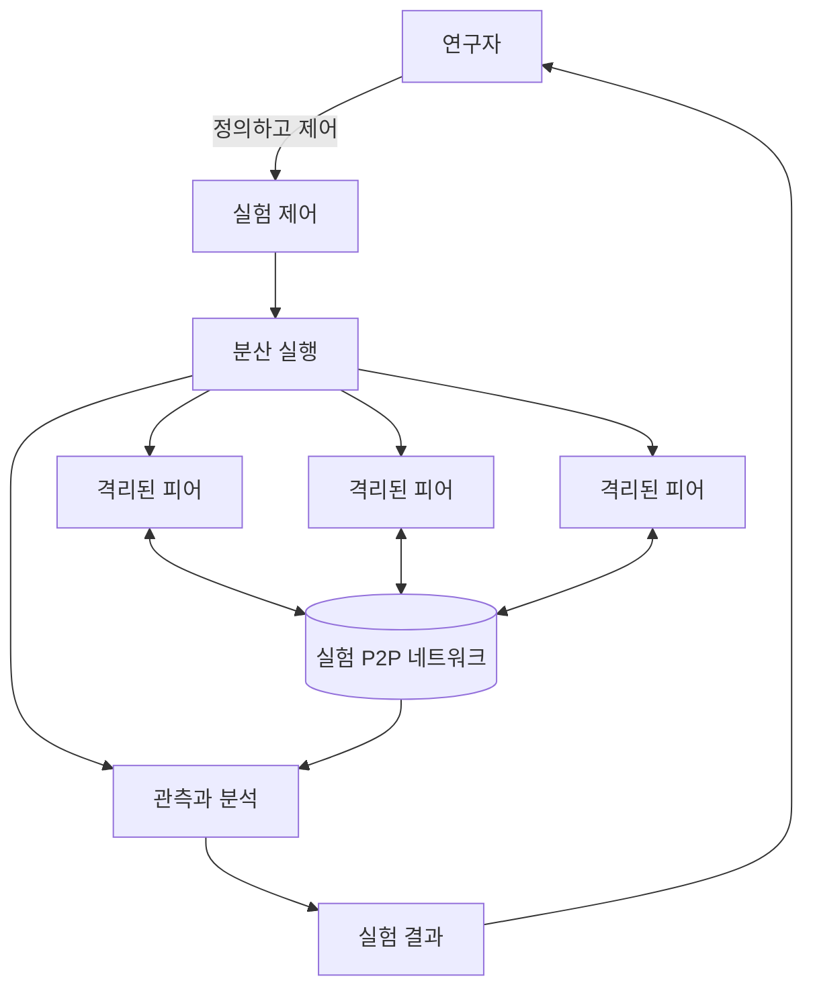

  

  <h1>K-P2PLab Hub</h1>

  

    <strong>K-P2PLab: 피어별 컨테이너 격리를 제공하는 중앙 오케스트레이션 기반 다중 호스트 P2P 테스트베드</strong>
  

  

    <a href="./README.md">English</a> ·
    <b>한국어</b>
  

  

    <b>개요</b> ·
    <a href="./docs/RESEARCH.kr.md">연구</a> ·
    <a href="https://github.com/k-p2p-lab/v3">공개 구현체</a>
  

---

## 개요

**K-P2PLab**은 통제된 실험 조건에서 피어 투 피어(P2P) 네트워크를 구성하고 실행하며 분석하는 연구용 테스트베드입니다. 실제 P2P 소프트웨어를 피어별 컨테이너에서 실행하고, 중앙에서 실험을 조정하면서 여러 호스트에 워크로드를 분산합니다.

이 저장소는 K-P2PLab의 **프로젝트 수준 Hub**입니다. 프로젝트의 목표, 설계 원칙, 개념 아키텍처, 발전 과정과 연구 논문을 한곳에 정리합니다.

> **실험 제어는 중앙에서, 피어 실행은 분산해서 수행합니다.**
>
> 플랫폼은 실험을 중앙에서 조정하며, 실험 대상 P2P 메시지는 피어 사이에서 교환됩니다.

---

## 문서 범위

| 저장소 | 정본으로 관리하는 내용 |
| --- | --- |
| **K-P2PLab Hub** | 프로젝트 목표, 버전 독립적인 설계 원칙, 개념 아키텍처, 프로젝트 발전 과정, 연구 주제, 논문과 인용 안내. |
| **구현 저장소** | 실행 동작, API와 시나리오 스키마, 명령과 환경 변수, 배포, 정확한 지표 공식과 이벤트, 운영 제약, 버전별 검증 기록. |

두 범위에 걸친 주제는 이 Hub에서 변하지 않는 개념을 설명하고, 정확한 동작 계약은 구현 저장소로 연결합니다. 현재 공개 구현체는 [K-P2PLab v3][v3-repo]입니다.

---

## 설계 원칙

| 원칙 | 의미 |
| --- | :--- |
| **중앙 오케스트레이션** | 중앙 제어 영역에서 실험 실행, 피어 수명 주기와 결과 수집을 조정합니다. |
| **다중 호스트 실행** | 실험을 단일 서버에 한정하지 않고 여러 호스트에 피어 워크로드를 분산합니다. |
| **실제 P2P 실행** | 피어를 모의 객체로만 표현하지 않고 실제 프로토콜 구현을 실행하여 네트워크 트래픽을 교환합니다. |
| **피어별 컨테이너 격리** | 각 피어에 별도의 컨테이너와 네트워크 네임스페이스를 제공하여 개별 관리가 가능한 실험 단위로 만듭니다. |

컨테이너 격리는 피어의 실행 환경과 네트워크 환경을 분리하지만, 전용 물리 자원을 제공하거나 같은 호스트의 자원 경합을 제거하지는 않습니다.

---

## 개념 아키텍처

**제어** 영역은 실험 동작과 피어 수명 주기를 조정합니다. **실행** 영역은 여러 호스트에 격리된 피어 워크로드를 배치하고 관리합니다. 피어는 **실험 P2P 네트워크**에서 프로토콜 트래픽을 교환합니다. **관측** 영역은 동작을 기록하고 연구자가 사용할 결과를 생성합니다.

이 그림은 특정 오케스트레이터, 모니터링 제품, 프로토콜 또는 운영체제 기능 대신 역할을 표현합니다. 공개 구현체의 구체적인 구성은 [v3 아키텍처 가이드][v3-architecture]를 참고하십시오.

---

## 프로젝트 발전 과정

K-P2PLab은 여러 연구 구현을 거치며 발전했습니다. 각 버전은 같은 연구 계보를 공유하지만 아키텍처, 실험 제어와 측정 기능은 서로 다릅니다.

| 버전 | 중심 내용 | 공개 여부 |
| :---: | :--- | :--- |
| **v3** | 시나리오 기반 제어, 호스트별 Agent와 확장된 관측 기능으로 재설계한 구현. | [공개 소스 저장소][v3-repo]. |
| **v2** | 다중 호스트 P2P 실험과 토폴로지 분석을 위한 후속 플랫폼 설계. | [플랫폼 논문][v2-paper]; 소스 코드는 공개하지 않음. |
| **v1** | P2P 네트워크 구성과 토폴로지 분석을 위한 최초 플랫폼. | [플랫폼 논문][v1-paper]; 소스 코드는 공개하지 않음. |

설치, 설정, 지원 기능과 구현별 제한사항은 해당 저장소와 논문을 참고하십시오.

---

  
    <b><a href="https://github.com/k-p2p-lab">K-P2PLab</a> · <a href="https://comnet.kmu.ac.kr">컴퓨터네트워크 연구실</a></b>, <i><a href="https://www.kmu.ac.kr">계명대학교</a>, 대한민국 대구</i>
  

[v3-repo]: https://github.com/k-p2p-lab/v3
[v3-architecture]: https://github.com/k-p2p-lab/v3/blob/master/docs/architecture.kr.md
[v1-paper]: https://doi.org/10.22670/knom.2024.27.2.40
[v2-paper]: https://doi.org/10.23919/APNOMS67058.2025.11181317
