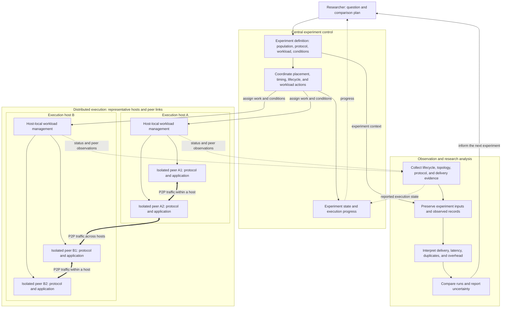
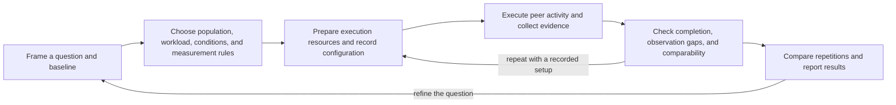

  

  <h1>K-P2PLab Hub</h1>

  

    <strong>K-P2PLab: A Centrally Orchestrated Multi-Host P2P Testbed with Per-Peer Container Isolation</strong>
  

  

    <b>English</b> ·
    <a href="./README.kr.md">한국어</a>
  

  

    <b>Overview</b> ·
    <a href="./docs/RESEARCH.md">Research</a> ·
    <a href="https://github.com/k-p2p-lab/v3">Public Implementation</a>
  

---

## Overview

**K-P2PLab** is a research testbed for constructing, running, and analyzing peer-to-peer (P2P) networks under controlled experimental conditions. It executes real P2P software in separate peer containers, with workloads distributed across hosts under central orchestration.

This repository is the **project-level hub** for K-P2PLab. It brings together the project's objectives, design principles, conceptual architecture, evolution, and research publications.

> **Centralized experiment control. Distributed peer execution.**
>
> The platform coordinates the experiment centrally; experimental P2P messages are exchanged between peers.

---

## Documentation Scope

| Repository | Canonical contents |
| --- | --- |
| **K-P2PLab Hub** | Project objectives, version-independent design principles, conceptual architecture, project evolution, research topics, publications, and citation guidance. |
| **Implementation repositories** | Executable behavior, APIs and scenario schemas, commands and environment variables, deployment, exact metric formulas and events, operational constraints, and version-specific validation records. |

For a topic that spans both scopes, this Hub states the stable concept and links to the implementation repository for the exact contract. The current public implementation is [K-P2PLab v3][v3-repo].

| To understand… | Start here | For the v3 implementation |
| --- | --- | --- |
| Why the testbed exists and how its roles relate | Overview, design principles, and conceptual architecture below | [Components, communication paths, and isolation][v3-architecture] |
| How an experiment is defined and executed | Experiment cycle below | [Scenario configuration][v3-scenarios] and [REST API][v3-api] |
| How workloads span hosts | Multi-host execution principle below | [Linux deployment][v3-linux] and [Swarm deployment][v3-swarm] |
| What an observation can establish | [Research and reporting principles](docs/RESEARCH.md) | [Metric definitions][v3-metrics], [monitoring and results][v3-monitoring], and [topology views][v3-topology] |
| Which work to cite | [Publications and citation guidance](docs/RESEARCH.md) | [v3 source and revision history][v3-repo] |

---

## Design Principles

| Principle | What it means |
| --- | :--- |
| **Central orchestration** | Coordinate experiment execution, peer lifecycle operations, and result collection through a central control plane. |
| **Multi-host execution** | Distribute peer workloads across multiple hosts rather than confining an experiment to a single server. |
| **Real P2P execution** | Run actual protocol implementations and exchange network traffic, rather than represent peers only as simulated entities. |
| **Per-peer container isolation** | Give each peer a separate container and network namespace, making the peer an individually managed experimental unit. |

Container isolation separates peer execution and networking environments; it does not imply dedicated physical resources or eliminate contention on a shared host.

---

## Conceptual Architecture

The testbed has three interacting responsibilities: experiment control, distributed peer execution, and observation. This view expands those responsibilities without prescribing a service layout.

**Reading the arrows.** Thin solid arrows describe instructions or the research workflow; thick bidirectional arrows describe experimental P2P traffic; dotted arrows describe observations. The illustrated hosts and peer links are examples, not a required host count, fixed topology, or full mesh. The P2P network is formed by the peers and their protocol relationships; it is not an additional central forwarding service.

| Responsibility | Conceptual boundary |
| --- | --- |
| **Experiment definition and control** | Express the intended population, protocol settings, workload, timing, and conditions; coordinate their execution and track reported progress. Intended settings and observed behavior can differ. |
| **Host-local execution** | Turn assigned work into individually managed peer workloads and collect local execution reports. The mechanism and placement policy depend on the implementation. |
| **Peer protocol execution** | Discover and connect to other peers, maintain protocol relationships, and exchange experimental messages. A centrally requested workload action initiates peer activity; it does not make the controller a P2P relay. |
| **Observation and records** | Associate execution and protocol evidence with experiment context. Reports can be delayed or missing, so collected state is an observation rather than complete knowledge of the network. |
| **Research analysis** | Interpret measurements, compare runs, and report assumptions and uncertainty. This includes researcher work outside the testbed; the box does not promise an automated analysis service. |

The separation above is logical. It does not guarantee separate processes, containers, physical networks, or fault domains for every box. Network conditions act on traffic within the chosen experimental scope, while shared host resources and the physical interconnect also affect the outcome. For concrete services, network attachments, supported controls, and measurement limits, see the [v3 architecture guide][v3-architecture].

---

## Experiment Cycle

An experiment connects a research question to evidence. The cycle below is a research workflow; it is not an executable scenario schema or an assertion that every step is automated.

Record planned inputs and observed outcomes separately. Reusing a configuration or random seed helps reproduce an experimental setup, but it does not guarantee identical execution timing, topology, or message delivery. Use the [research reporting principles](docs/RESEARCH.md) to define the comparison and the [v3 scenario guide][v3-scenarios] to express supported actions.

---

## Project Evolution

K-P2PLab has evolved through successive research implementations. The versions share a research lineage, but differ in architecture, experimental controls, and measurement capabilities.

| Version | Focus | Availability |
| :---: | :--- | :--- |
| **v3** | Redesigned implementation with scenario-driven control, host-local agents, and expanded observation capabilities. | [Public source repository][v3-repo]. |
| **v2** | Subsequent platform design for multi-host P2P experiments and topology analysis. | [Platform paper][v2-paper]; source code not publicly released. |
| **v1** | Initial platform for P2P network construction and topology analysis. | [Platform paper][v1-paper]; source code not publicly released. |

For installation, configuration, supported features, and implementation-specific limitations, consult the relevant repository and publication.

---

  
    <b><a href="https://github.com/k-p2p-lab">K-P2PLab</a> · <a href="https://comnet.kmu.ac.kr">Computer Network Laboratory</a></b>, <i><a href="https://www.kmu.ac.kr">Keimyung University</a>, Daegu, Republic of Korea</i>
  

[v3-repo]: https://github.com/k-p2p-lab/v3
[v3-architecture]: https://github.com/k-p2p-lab/v3/blob/master/docs/architecture.md
[v3-scenarios]: https://github.com/k-p2p-lab/v3/blob/master/docs/scenario-reference.md
[v3-api]: https://github.com/k-p2p-lab/v3/blob/master/docs/api.md
[v3-linux]: https://github.com/k-p2p-lab/v3/blob/master/docs/linux-deployment.md
[v3-swarm]: https://github.com/k-p2p-lab/v3/blob/master/docs/swarm.md
[v3-metrics]: https://github.com/k-p2p-lab/v3/blob/master/docs/experiment-metrics.md
[v3-monitoring]: https://github.com/k-p2p-lab/v3/blob/master/docs/monitoring.md
[v3-topology]: https://github.com/k-p2p-lab/v3/blob/master/docs/topology.md
[v1-paper]: https://doi.org/10.22670/knom.2024.27.2.40
[v2-paper]: https://doi.org/10.23919/APNOMS67058.2025.11181317
