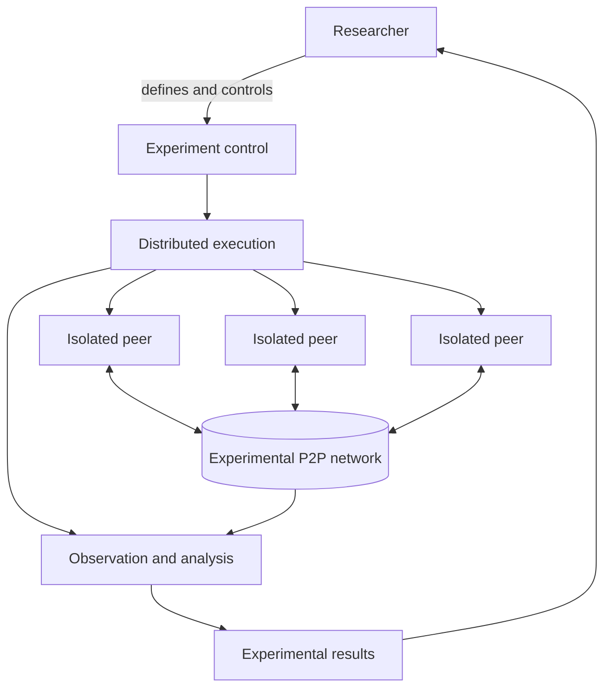

  

  <h1>K-P2PLab Hub</h1>

  

    <strong>K-P2PLab: A Centrally Orchestrated Multi-Host P2P Testbed with Per-Peer Container Isolation</strong>
  

  

    <b>English</b> ·
    <a href="./README.kr.md">한국어</a>
  

  

    <b>Overview</b> ·
    <a href="./docs/RESEARCH.md">Research</a> ·
    <a href="https://github.com/k-p2p-lab/v3">Public Implementation</a>
  

---

## Overview

**K-P2PLab** is a research testbed for constructing, running, and analyzing peer-to-peer (P2P) networks under controlled experimental conditions. It executes real P2P software in separate peer containers, with workloads distributed across hosts under central orchestration.

This repository is the **project-level hub** for K-P2PLab. It brings together the project's objectives, design principles, conceptual architecture, evolution, and research publications.

> **Centralized experiment control. Distributed peer execution.**
>
> The platform coordinates the experiment centrally; experimental P2P messages are exchanged between peers.

---

## Documentation Scope

| Repository | Canonical contents |
| --- | --- |
| **K-P2PLab Hub** | Project objectives, version-independent design principles, conceptual architecture, project evolution, research topics, publications, and citation guidance. |
| **Implementation repositories** | Executable behavior, APIs and scenario schemas, commands and environment variables, deployment, exact metric formulas and events, operational constraints, and version-specific validation records. |

For a topic that spans both scopes, this Hub states the stable concept and links to the implementation repository for the exact contract. The current public implementation is [K-P2PLab v3][v3-repo].

---

## Design Principles

| Principle | What it means |
| --- | :--- |
| **Central orchestration** | Coordinate experiment execution, peer lifecycle operations, and result collection through a central control plane. |
| **Multi-host execution** | Distribute peer workloads across multiple hosts rather than confining an experiment to a single server. |
| **Real P2P execution** | Run actual protocol implementations and exchange network traffic, rather than represent peers only as simulated entities. |
| **Per-peer container isolation** | Give each peer a separate container and network namespace, making the peer an individually managed experimental unit. |

Container isolation separates peer execution and networking environments; it does not imply dedicated physical resources or eliminate contention on a shared host.

---

## Conceptual Architecture

**Control** coordinates experimental actions and peer lifecycles. **Execution** places and manages isolated peer workloads across hosts. The peers exchange protocol traffic through the **experimental P2P network**. **Observation** records behavior and produces results for the researcher.

The diagram intentionally describes roles rather than a particular orchestrator, monitoring product, protocol, or operating-system mechanism. See the [v3 architecture guide][v3-architecture] for the concrete public implementation.

---

## Project Evolution

K-P2PLab has evolved through successive research implementations. The versions share a research lineage, but differ in architecture, experimental controls, and measurement capabilities.

| Version | Focus | Availability |
| :---: | :--- | :--- |
| **v3** | Redesigned implementation with scenario-driven control, host-local agents, and expanded observation capabilities. | [Public source repository][v3-repo]. |
| **v2** | Subsequent platform design for multi-host P2P experiments and topology analysis. | [Platform paper][v2-paper]; source code not publicly released. |
| **v1** | Initial platform for P2P network construction and topology analysis. | [Platform paper][v1-paper]; source code not publicly released. |

For installation, configuration, supported features, and implementation-specific limitations, consult the relevant repository and publication.

---

  
    <b><a href="https://github.com/k-p2p-lab">K-P2PLab</a> · <a href="https://comnet.kmu.ac.kr">Computer Network Laboratory</a></b>, <i><a href="https://www.kmu.ac.kr">Keimyung University</a>, Daegu, Republic of Korea</i>
  

[v3-repo]: https://github.com/k-p2p-lab/v3
[v3-architecture]: https://github.com/k-p2p-lab/v3/blob/master/docs/architecture.md
[v1-paper]: https://doi.org/10.22670/knom.2024.27.2.40
[v2-paper]: https://doi.org/10.23919/APNOMS67058.2025.11181317
